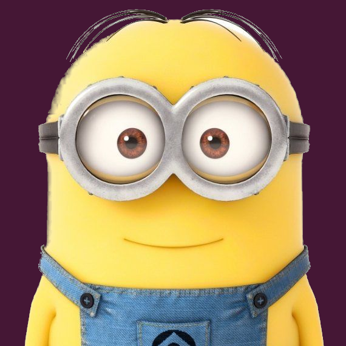
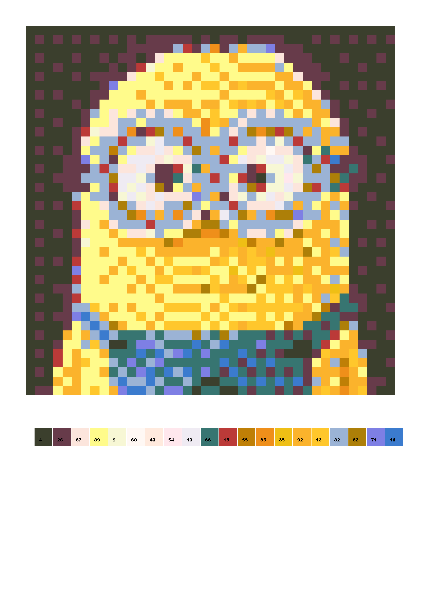
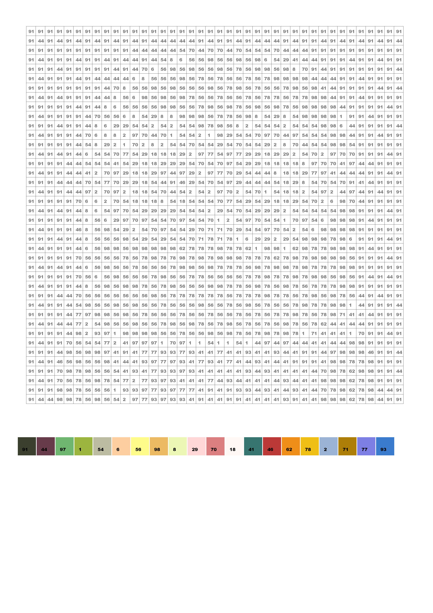

# pacbyn
Creates a **pa**lletised, pixelised **c**olour-**by**-**n**umbers for kids, 
from an input image.

## parameters
* -i: input image (must be square)
* -w: output pixel rows & columns (default 40)
* -n: nr of colours in the pallete (default 20)
* -o: output image (default output.png)
* -d: produces a debug output image
* -k: key generation method, one of the following (default INT_RAND):
   * INT_SEQ: sequential integers, starting at 0
   * INT_RAND: random integers in [0,100) 
   * ALPHA_SEQ: sequential lower case letters, starting at 'a'
   * ALPHA_RAND: random lower case letters in [a,z]

## examples

Given this image:


```mclachlan.pacbyn.Main -i minion.png -o output_example.png -d```



```mclachlan.pacbyn.Main -i minion.png -o output_example.png```




