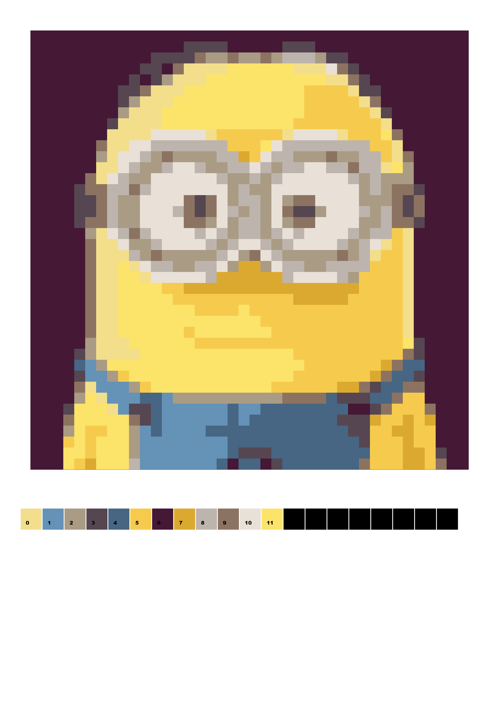
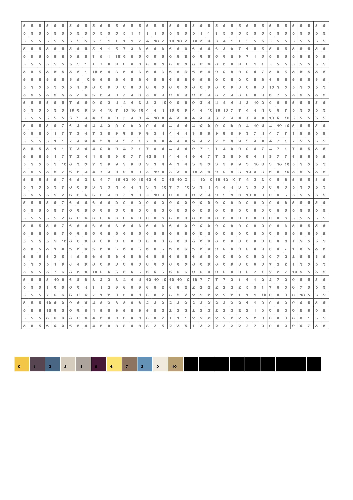

# pacbyn
Creates a **pa**lletised, pixelised **c**olour-**by**-**n**umbers for kids, 
from an input image.

## parameters
* -i: input image (must be square)
* -w: output pixel rows & columns (default 40)
* -n: nr of colours in the pallete (default 20)
* -o: output image (default output.png)
* -d: produces a debug output image

## examples

Given this image:


```mclachlan.pacbyn.Main -i minion.png -o output_example.png -d```



```mclachlan.pacbyn.Main -i minion.png -o output_example.png```




